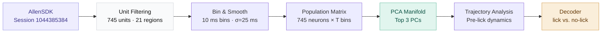
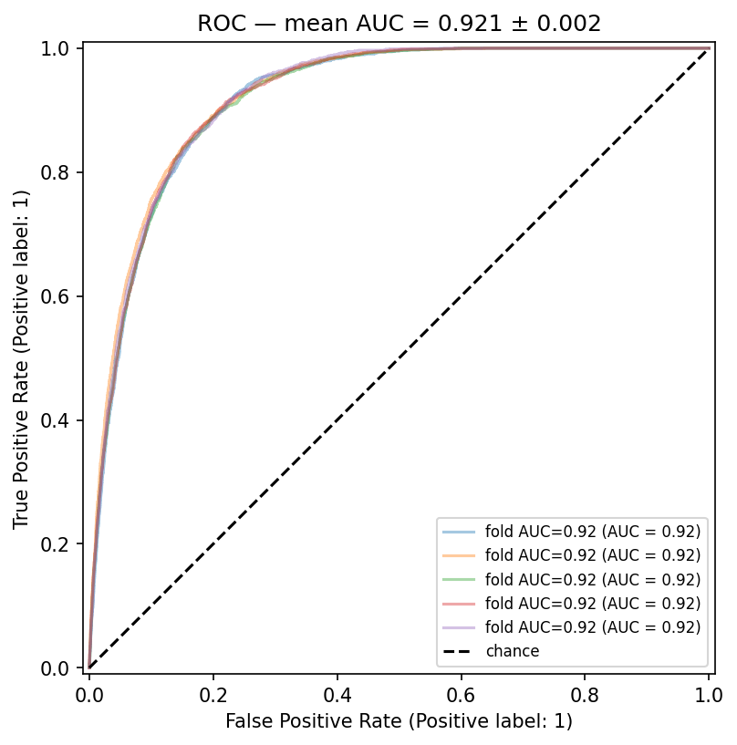
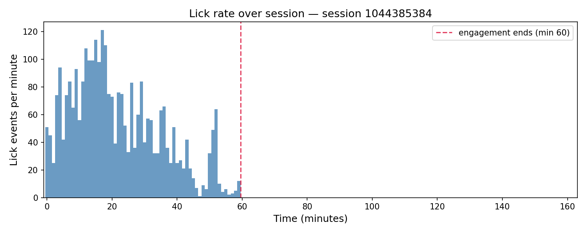

# Allen Neuropixels Lick Decoder

Decoding lick behavior from multi-region population spike trains recorded with Neuropixels probes in the Allen Brain Observatory. Extracts single-unit activity from 745 neurons across 21 brain areas, constructs a low-dimensional PCA manifold of population dynamics, and visualizes pre-lick neural trajectories in PC-space.

[](https://colab.research.google.com/github/jadenbalajadia/allen-neuropixels-decoder/blob/main/notebooks/04_decoding.ipynb)


---

## Pipeline



---

## Key Results

| Metric | Value |
|---|---|
| Session | 1044385384 |
| Units analyzed | 745 |
| Brain regions | 21 (CA1, VISpm, VISl, POL, DG, VISrl, LP, MRN, TH, VISal, and more) |
| AUC-ROC — shuffled k-fold | 0.955 ± 0.003 (5 folds) |
| AUC-ROC — blocked CV, fold 1 (0–32 min) | 0.843 |
| AUC-ROC — blocked CV, fold 2 (32–65 min) | 0.882 |
| AUC-ROC — blocked CV, folds 3–5 (65–162 min) | — (no lick events) |
| Chance level (AUC) | 0.5 |

---

## Brain Region Coverage

| Region | Units | Description |
|---|---|---|
| CA1 | 151 | Hippocampus — spatial/memory |
| VISpm | 91 | Posteromedial visual cortex |
| VISl | 82 | Lateral visual cortex |
| POL | 63 | Posterior occipital area |
| DG | 53 | Dentate gyrus |
| VISrl | 47 | Rostrolateral visual cortex |
| LP | 37 | Lateral posterior thalamic nucleus |
| MRN | 30 | Midbrain reticular nucleus |
| TH | 28 | Thalamus |
| VISal | 28 | Anterolateral visual cortex |
| *(+ 11 more)* | 135 | PoT, SGN, CA3, VISp, POST, SCig, MB, LGv, ZI, MGd, MGm |

---

## Results

### Decoder performance (ROC curve)



*Mean ROC curve across 5 stratified folds. AUC = 0.955 — well above the 0.5 chance baseline. Because lick events represent ~5% of time bins, AUC-ROC is reported as the primary metric; raw accuracy is misleading under this class imbalance.*

### CV methodology and both estimates

Two cross-validation strategies are reported:

**Shuffled k-fold (AUC = 0.955 ± 0.003):** StratifiedKFold with shuffle=True randomly scatters 50 ms bins across folds. At 20 Hz, neighboring bins are highly autocorrelated, so a test bin can be near-duplicated by a training bin milliseconds away — this slightly inflates AUC relative to true out-of-distribution generalization.

**Blocked CV (2/5 folds scored — not averaged):** The session is split into five equal contiguous chunks (~32.8 min each); each chunk is held out in turn. Only the first two folds contain lick events, so only those are scored:

| Fold | Window | Licks | AUC |
|---|---|---|---|
| 1 | 0–32.5 min | 2,353 (6.0%) | **0.843** |
| 2 | 32.5–65.0 min | 687 (1.8%) | **0.882** |
| 3–5 | 65–162 min | 0 | — |

These two AUCs are not averaged into a single number — a 2-fold result is not directly comparable to the 5-fold shuffled estimate and shouldn't be presented as if it were. The ~7–11 point gap relative to shuffled CV reflects real temporal autocorrelation between adjacent 50 ms bins; a test bin can be near-duplicated by a training bin milliseconds away under random shuffling.

Inside each fold (both strategies), train and test indices are sorted back into ascending time order before Gaussian smoothing, so the kernel operates on temporally adjacent bins. PCA, StandardScaler, and LogisticRegression are all fit on training data only.

### Session behavior: lick concentration

All 3,040 lick events occur within the first 60 minutes of a 162-minute recording; the remaining 102 minutes contain zero licks. This is a property of the animal's behavior during the session, not an artifact of any analysis choice.

The figure below shows lick rate in 1-minute bins. Activity peaks sharply around minute 17 (~120 licks/min), then declines steadily and noisily through minute 40, dips low around minute 47–50, shows a brief secondary burst near minute 52 (~64 licks/min), then falls to near-zero by minute 60.



*Lick rate per minute across the 162-minute session. Activity peaks sharply near minute 17 (~120 licks/min), declines steadily through minute 40, dips low around minute 47–50, shows a brief secondary burst near minute 52, then falls to near-zero by minute 60 — 102 minutes of complete silence follow.*

The most likely explanations are satiation (the animal consumed enough reward to disengage), fatigue, or a behavioral state transition out of active task engagement. Neural activity continues throughout the session — only the lick-driven labeling cuts off at minute 60. Analyses that assume uniform lick rates (e.g., naive blocked CV) encounter empty test folds in the silent period; this is acknowledged by reporting per-fold AUCs rather than averaging across all five folds.

### Population dynamics (PCA manifold)

*2D projection of 745-neuron population activity into PC1–PC2 space, colored by lick label. Lick (y=1) and no-lick (y=0) trials occupy distinct regions of the manifold.*

### Pre-lick trajectories

*40-bin (400 ms) neural trajectories immediately preceding each lick event (first 100 licks shown). Convergence toward a common endpoint in PC-space suggests a consistent pre-motor neural signature.*

### Brain region distribution

*Number of filtered units per brain area. CA1 contributes the most units (151), with strong representation across visual cortex (VISpm, VISl, VISrl, VISal) and hippocampal formation.*

---

## Repo structure

```
allen-neuropixels-decoder/
├── README.md
├── environment.yml
├── .gitignore
├── data/
│   └── README.md                              # download instructions
├── notebooks/
│   ├── 03_pca_manifold.ipynb                  # PCA, 2D/3D trajectory visualization
│   └── 04_decoding.ipynb                      # logistic regression, cross-val, ROC
├── src/
│   ├── __init__.py
│   ├── preprocessing.py                       # spike binning, smoothing, AllenSDK helpers
│   ├── manifold.py                            # PCA wrapper + trajectory plotting
│   └── decoder.py                             # logistic regression, cross-val, ROC
└── figures/                                   # saved output figures
```

---

## Setup

**Local:**
```bash
git clone https://github.com/jadenbalajadia/allen-neuropixels-decoder.git
cd allen-neuropixels-decoder
conda env create -f environment.yml
conda activate allen-decoder
jupyter lab
```

**Colab (no install):**
Click the "Open in Colab" badge above. The notebook mounts a shared Google Drive folder containing the pre-extracted `.npy` arrays — AllenSDK download not required.

---

## Data

Raw data is downloaded via the Allen Brain Observatory SDK. Session ID: `1044385384`.

```python
from allensdk.brain_observatory.ecephys.ecephys_project_cache import EcephysProjectCache

cache = EcephysProjectCache.from_warehouse(manifest=manifest_path)
session = cache.get_session_data(1044385384)
```

Pre-extracted arrays are available in the shared [Google Drive folder](https://drive.google.com/drive/folders/1RAW7LVEXndBrboPt53YSQgfGjjS9JFeQ?usp=drive_link):

| File | Description | Shape |
|---|---|---|
| `session_1044385384_X_raw.npy` | Raw spike rate matrix (input to decoder) | `(T, n_units)` |
| `session_1044385384_y.npy` | Lick behavior labels (0/1) | `(T,)` |
| `session_1044385384_labels_corrected.csv` | Bin timestamps + lick labels | — |
| `session_1044385384_filtered_units_with_regions.csv` | Unit metadata + brain regions | `(745, 36)` |

See `data/README.md` for full download instructions.

---

## Notebooks

| Notebook | What it does |
|---|---|
| `03_pca_manifold` | PCA on 745×T population matrix; 2D/3D trajectory visualization; pre-lick trajectory overlays |
| `04_decoding` | Logistic regression decoder; corrected 5-fold CV (smooth→PCA→scale inside folds); ROC curve (AUC = 0.955) |

---

## Methods

**Unit selection.** Single units were loaded from Allen Brain Observatory Neuropixels session `1044385384` using the AllenSDK. 745 units passing quality thresholds (ISI violations, isolation distance, SNR) were retained, spanning 21 brain areas including CA1, visual cortex (VISpm, VISl, VISrl, VISal), hippocampal subfields (DG, CA3), and thalamic nuclei (LP, TH, MRN).

**Spike extraction.** Spike trains were binned into 10 ms windows and smoothed with a Gaussian kernel (σ = 25 ms), producing a continuous (T × 745) firing rate matrix.

**Dimensionality reduction.** PCA was applied to the population firing rate matrix. The top 3 principal components were retained for visualization. Pre-lick trajectories were extracted by taking 40-bin (400 ms) windows immediately preceding each lick event.

**Decoding.** A logistic regression classifier was trained on PCA-reduced activity to distinguish lick from no-lick time bins. Performance was evaluated using 5-fold stratified cross-validation. Because lick events represent ~5% of time bins, balanced accuracy and AUC-ROC are reported as primary metrics.

---

## Dependencies

```
allensdk, numpy, scipy, scikit-learn, matplotlib, pandas
```

Full environment: see `environment.yml`.

---

## Acknowledgments

Data provided by the [Allen Brain Observatory](https://observatory.brain-map.org/visualcoding) via the Allen Institute for Brain Science.

---

## Citation

```bibtex
@misc{balajadia2025allen,
  author = {Balajadia, Jaden},
  title  = {Allen Neuropixels Lick Decoder},
  year   = {2025},
  url    = {https://github.com/jadenbalajadia/allen-neuropixels-decoder}
}
```
