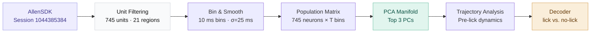

# Allen Neuropixels Lick Decoder

Decoding lick behavior from multi-region population spike trains recorded with Neuropixels probes in the Allen Brain Observatory. Extracts single-unit activity from 745 neurons across 21 brain areas, constructs a low-dimensional PCA manifold of population dynamics, and visualizes pre-lick neural trajectories in PC-space.

[](https://colab.research.google.com/github/YOUR_USERNAME/allen-neuropixels-decoder/blob/main/colab/run_pipeline.ipynb)


---

## Pipeline



---

## Key Results

| Metric | Value |
|---|---|
| Session | 1044385384 |
| Units analyzed | 745 |
| Brain regions | 21 (CA1, VISpm, VISl, POL, DG, VISrl, LP, MRN, TH, VISal, and more) |
| Decoder accuracy (test set) | [XX% — add after running 04_decoding] |
| AUC-ROC | [X.XX — add after running 04_decoding] |
| Chance level | ~50% |

---

## Brain Region Coverage

| Region | Units | Description |
|---|---|---|
| CA1 | 151 | Hippocampus — spatial/memory |
| VISpm | 91 | Posteromedial visual cortex |
| VISl | 82 | Lateral visual cortex |
| POL | 63 | Posterior occipital area |
| DG | 53 | Dentate gyrus |
| VISrl | 47 | Rostrolateral visual cortex |
| LP | 37 | Lateral posterior thalamic nucleus |
| MRN | 30 | Midbrain reticular nucleus |
| TH | 28 | Thalamus |
| VISal | 28 | Anterolateral visual cortex |
| *(+ 11 more)* | 135 | PoT, SGN, CA3, VISp, POST, SCig, MB, LGv, ZI, MGd, MGm |

---

## Results

### Population dynamics (PCA manifold)

<!-- After generating figures, add them here: -->
<!--  -->

*2D projection of 745-neuron population activity into PC1–PC2 space, colored by lick label. Lick (y=1) and no-lick (y=0) trials occupy distinct regions of the manifold.*

### Pre-lick trajectories

<!--  -->

*40-bin (400 ms) neural trajectories immediately preceding each lick event (first 100 licks shown). Convergence toward a common endpoint in PC-space suggests a consistent pre-motor neural signature.*

### Brain region distribution

<!--  -->

*Number of filtered units per brain area. CA1 contributes the most units (151), with strong representation across visual cortex (VISpm, VISl, VISrl, VISal) and hippocampal formation.*

---

## Repo structure

```
allen-neuropixels-decoder/
├── README.md
├── environment.yml
├── .gitignore
├── data/
│   └── README.md                              # download instructions
├── notebooks/
│   ├── 01_data_exploration.ipynb              # load session, inspect spike trains
│   ├── 02_spike_extraction.ipynb              # unit filtering, binning, smoothing
│   ├── 03_pca_manifold.ipynb                  # PCA, 2D/3D trajectory visualization
│   └── 04_decoding.ipynb                      # logistic regression, cross-val, ROC
├── src/
│   ├── __init__.py
│   ├── preprocessing.py                       # spike binning, smoothing, AllenSDK helpers
│   ├── manifold.py                            # PCA wrapper + trajectory plotting
│   └── decoder.py                             # logistic regression, cross-val, ROC
├── figures/                                   # saved output figures
└── colab/
    └── run_pipeline.ipynb                     # self-contained Colab demo (loads from Drive)
```

---

## Setup

**Local:**
```bash
git clone https://github.com/YOUR_USERNAME/allen-neuropixels-decoder.git
cd allen-neuropixels-decoder
conda env create -f environment.yml
conda activate allen-decoder
jupyter lab
```

**Colab (no install):**
Click the "Open in Colab" badge above. The notebook mounts a shared Google Drive folder at `/content/drive/MyDrive/lickingpcaoutputs` containing the pre-extracted `.npy` arrays — AllenSDK download not required.

---

## Data

Raw data is downloaded via the Allen Brain Observatory SDK. Session ID: `1044385384`.

```python
from allensdk.brain_observatory.ecephys.ecephys_project_cache import EcephysProjectCache

cache = EcephysProjectCache.from_warehouse(manifest=manifest_path)
session = cache.get_session_data(1044385384)
```

Pre-extracted arrays are available in the shared [Google Drive folder](YOUR_DRIVE_LINK):

| File | Description | Shape |
|---|---|---|
| `session_1044385384_Z.npy` | PCA-reduced population activity | `(T, 3)` |
| `session_1044385384_X_proc.npy` | Processed firing rate matrix | `(T, 745)` |
| `session_1044385384_y.npy` | Lick behavior labels (0/1) | `(T,)` |
| `session_1044385384_labels.csv` | Trial metadata | — |
| `session_1044385384_filtered_units_with_regions.csv` | Unit metadata + brain regions | `(745, 36)` |

See `data/README.md` for full download instructions.

---

## Notebooks

| Notebook | What it does |
|---|---|
| `01_data_exploration` | Load session, inspect spike trains, visualize rasters, check unit quality metrics |
| `02_spike_extraction` | Filter 745 units, bin spikes (10 ms), apply Gaussian smoothing |
| `03_pca_manifold` | PCA on 745×T population matrix; 2D/3D trajectory visualization; pre-lick trajectory overlays |
| `04_decoding` | Logistic regression on PCA-reduced activity; k-fold cross-validation; ROC curve |

---

## Methods

**Unit selection.** Single units were loaded from Allen Brain Observatory Neuropixels session `1044385384` using the AllenSDK. 745 units passing quality thresholds (ISI violations, isolation distance, SNR) were retained, spanning 21 brain areas including CA1, visual cortex (VISpm, VISl, VISrl, VISal), hippocampal subfields (DG, CA3), and thalamic nuclei (LP, TH, MRN).

**Spike extraction.** Spike trains were binned into 10 ms windows and smoothed with a Gaussian kernel (σ = 25 ms), producing a continuous (T × 745) firing rate matrix.

**Dimensionality reduction.** PCA was applied to the population firing rate matrix. The top 3 principal components were retained for visualization. Pre-lick trajectories were extracted by taking 40-bin (400 ms) windows immediately preceding each lick event.

**Decoding.** A logistic regression classifier was trained on PCA-reduced activity to distinguish lick from no-lick time bins. Performance was evaluated using k-fold cross-validation; chance level is ~50%.

---

## Dependencies

```
allensdk, numpy, scipy, scikit-learn, matplotlib, pandas
```

Full environment: see `environment.yml`.

---

## Acknowledgments

Data provided by the [Allen Brain Observatory](https://observatory.brain-map.org/visualcoding) via the Allen Institute for Brain Science.

---

## Citation

```bibtex
@misc{balajadia2025allen,
  author = {Balajadia, Jaden},
  title  = {Allen Neuropixels Lick Decoder},
  year   = {2025},
  url    = {https://github.com/YOUR_USERNAME/allen-neuropixels-decoder}
}
```
